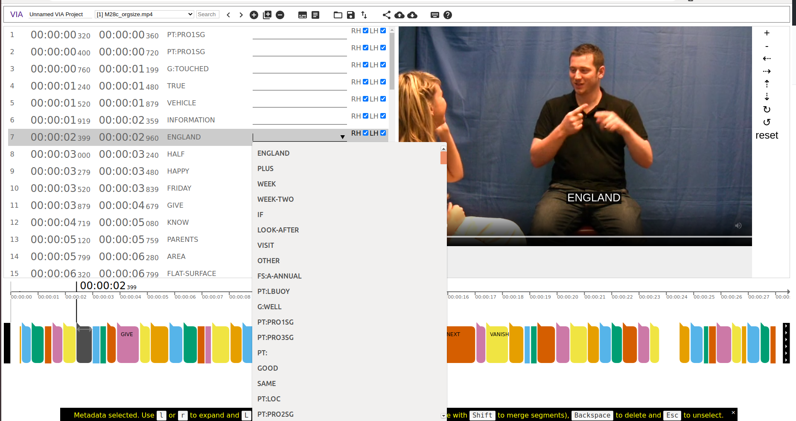

# VIA Sign Language Annotator (VIA-SLA)
This repository contains the code for a modification of the VIA subtitle annotator to annotate sign language videos.
With [this repo](https://github.com/RenzKa/sign-segmentation) it is possible to extract proposals for sign segments and sign names.
For more detailed information about the VIA tool please visit the [VIA website](https://www.robots.ox.ac.uk/~vgg/software/via/).



## Usage
* Open `dist/via_subtitle_annotator.html`.
* Import video (2.) 
* [Optional] Load `.txt` file with sign class names. These class names appear in the dropdown menu. (3.)
* [Optional] Load pre-extracted `.vtt` file generated from [this repo](https://github.com/RenzKa/sign-segmentation). The top-10 class predictions appear at the top of the dropdown menu. (4.)
* Generate/ Adjust segments on the bottom.
* Write/ select sign class.
* Export annotation files (seperate for right and left hand)


## Citation
If you use this tool and the proposals, please cite the following:
```
@inproceedings{Renz2021signsegmentation_a,
    author       = "Katrin Renz and Nicolaj C. Stache and Samuel Albanie and G{\"u}l Varol",
    title        = "Sign Language Segmentation with Temporal Convolutional Networks",
    booktitle    = "ICASSP",
    year         = "2021",
}
```
```
@inproceedings{Renz2021signsegmentation_b,
    author       = "Katrin Renz and Nicolaj C. Stache and Neil Fox and G{\"u}l Varol and Samuel Albanie",
    title        = "Sign Segmentation with Changepoint-Modulated Pseudo-Labelling",
    booktitle    = "CVPRW",
    year         = "2021",
}
```
```
@inproceedings{dutta2019vgg,
  author = {Dutta, Abhishek and Zisserman, Andrew},
  title = {The {VIA} Annotation Software for Images, Audio and Video},
  booktitle = {Proceedings of the 27th ACM International Conference on Multimedia},
  series = {MM '19},
  year = {2019},
  isbn = {978-1-4503-6889-6/19/10},
  location = {Nice, France},
  numpages = {4},
  url = {https://doi.org/10.1145/3343031.3350535},
  doi = {10.1145/3343031.3350535},
  publisher = {ACM},
  address = {New York, NY, USA},
} 
```
